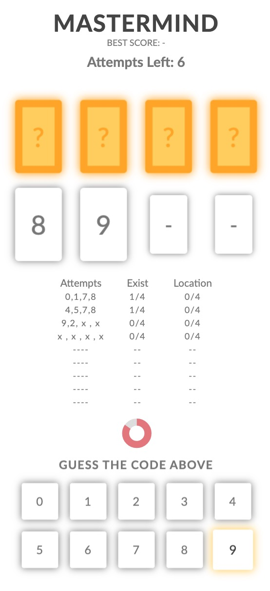
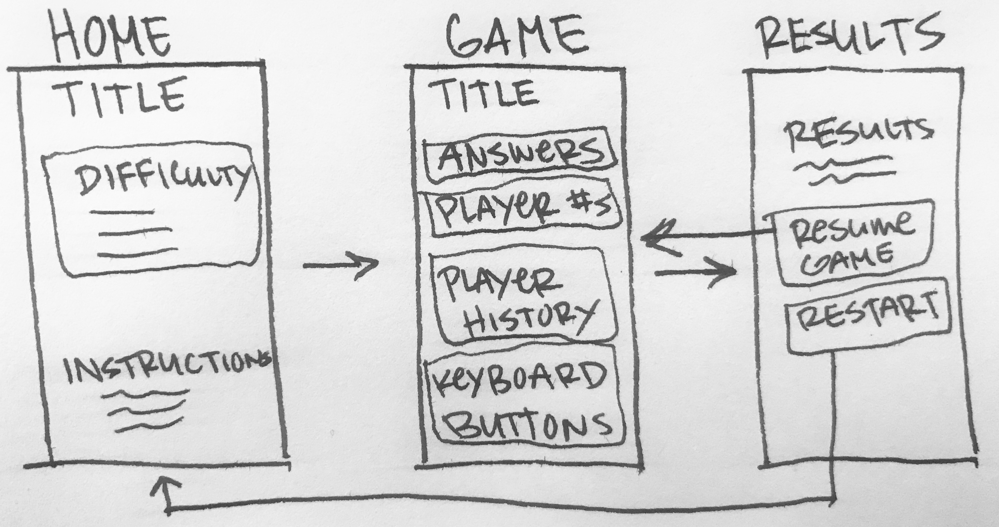

<div align="center">
<h1>Mastermind</h1>
Mastermind is a game where players have 10 attempts to guess the location of 4 numbers

&nbsp;


[Play Game](https://kevinreber.github.io/mastermind/) 
&nbsp;
&nbsp;
[Source Code](https://github.com/kevinreber/mastermind)
</div>

## Download Game
* ### Download from GitHub
    * [Source Code](https://github.com/kevinreber/mastermind)

* ### Download from Command Line
    * Must have Git [installed](https://git-scm.com/book/en/v2/Getting-Started-Installing-Git)

    * Paste into Command Line

    ```
    $ git clone https://github.com/kevinreber/mastermind
    ```
 ## How to Run Game

* After downloading files, open index.html in browser to play game

## How to Play


* Player selects a [difficulty](#difficulty)
* Player has 10 attempts to guess the location of 4 numbers in limited time
* After each attempt player has 10 seconds to view their results
* Game ends when player runs out of attempts or matches all numbers

## <a id="difficulty"></a>Difficulty levels

* <strong>Easy</strong> -    Timer: 25 seconds, Keyboard Numbers: 0-5
* <strong>Medium</strong> -  Timer: 20 seconds, Keyboard Numbers: 0-7
* <strong>Hard</strong> -    Timer: 15 seconds, Keyboard Numbers: 0-9

## 🛠️ Building Mastermind

* ### Goals
    * Display how many attempts player has
    * Generate 4 random integers using [Random.Org API](https://www.random.org/clients/http/api/)
    * Numbers must be between 0-7
    * Player needs a way to guess 4 random numbers - make keyboard for mobile users
    * Results need to be shown after Player has made 4 guesses
    * Player needs a way to continue game after results displayed
    * Number of attempts needs to be updated each turn
    * Player must have a way to view previous results
    * Notify player when game is over

* ### Design Concept

    <div style="text-align:center">
    
    </div>

    * Minimalist approach
    * Desktop & Mobile friendly
    * Reveal answers when game is over

* ### Game Data

    * ```gameData``` is a global variable that stores/updates player and game information 

    ```
    let gameData = {
            bestScore: 11, // Placeholder to compare if Best Score exists
            attemptsPlayerHasLeft: 10,  // Updates attempts on game screen
            attemptPlayerIsOn: 1, // Reference to update player history
            guessPlayerIsOn: 1, // Stores guess player is on
            randomAPIResults: [], // Stores numbers from API call
            playerInput: [] // Stores player's input
    }
    ```


* ### Home Screen

    * Each difficulty displays different numbers in the game keyboard and the amount of time players have to make an attempt. [See difficulty levels](#difficulty)
    * Home screen listens for user to select difficulty then calls ```function selectDifficulty(e)```
    * When user selects difficulty, that information is taken from &nbsp;```gameDifficulty```&nbsp; and stored into a global variable &nbsp; ```let selectedDifficulty;```
    ```   
    const gameDifficulty = {           //Settings for game difficulty
            easy: {
                keyboardMax: 5,
                timer: 25
            },
            medium: {
                keyboardMax: 7,
                timer: 20
            },
            hard: {
                keyboardMax: 9,
                timer: 15
            }
        }
    ```

    ```
    // Example: Player selects "easy" difficulty
    let selectedDifficulty = {
        keyboardMax: 5;
        timer: 25
    }
    ```

    * After storing difficulty, &nbsp; ```await function startGame()``` initializes and calls [Random.Org API](https://www.random.org/clients/http/api/)

    * Results from API call are stored in &nbsp; ```gameData[randomAPIResults]```

    * If API call fails, fallback function gets called ```randomNumbersFallback()``` that generates random integers to store in &nbsp; ```gameData[randomAPIResults]```

    * Once results are stored, &nbsp; ```checkIfBestScoreExists()``` is called to check local storage if any best score's exist.

    * Game Screen is then rendered &nbsp;(```renderGameBoard()```) &nbsp; and timer begins &nbsp;(```startTimerBar(seconds)```)

* ### Game Screen

    * Player is only allowed 4 guesses per attempt.

    * ```playerMakesGuess(e)``` keeps track of player's guesses and calls &nbsp;```checkAnswers()``` when player has made 4 guesses or timer runs out.

    * ```checkAnswers()``` checks if player's guesses are correct and renders results on screen.

    * Game is not over until player has matched all 4 random numbers or player has 0 attempts left.

    * Player who has matched all 4 random numbers in the least amount of attempts has their number of attempts stored in "Best Score"

## Extensions Implemented

* Difficulty Levels
* Instructions
* Timer
* Animations
* Media Queries
* Local Storage to store Best Score

## Extensions To Add/Improve

* Local Storage for different difficulties
* Show player history on Results Screen
* Improve animations
* Sound
* Different design for desktop

## 🛠️ Built With

* [Normalize CSS](https://github.com/necolas/normalize.css/) - Modern alternative to CSS resets
* [Sass](https://sass-lang.com/install) - CSS preprocessor
* [Axios](https://github.com/axios/axios) - Promise based HTTP client for the browser and node.js
* [Random.Org](https://www.random.org/clients/http/api/) - Random number generator API

## 👤 Authors

* Kevin Reber &nbsp; [Github](https://github.com/kevinreber) &nbsp; | &nbsp; [Portfolio](https://kevinreber.github.io/kevin-reber-portfolio/)
